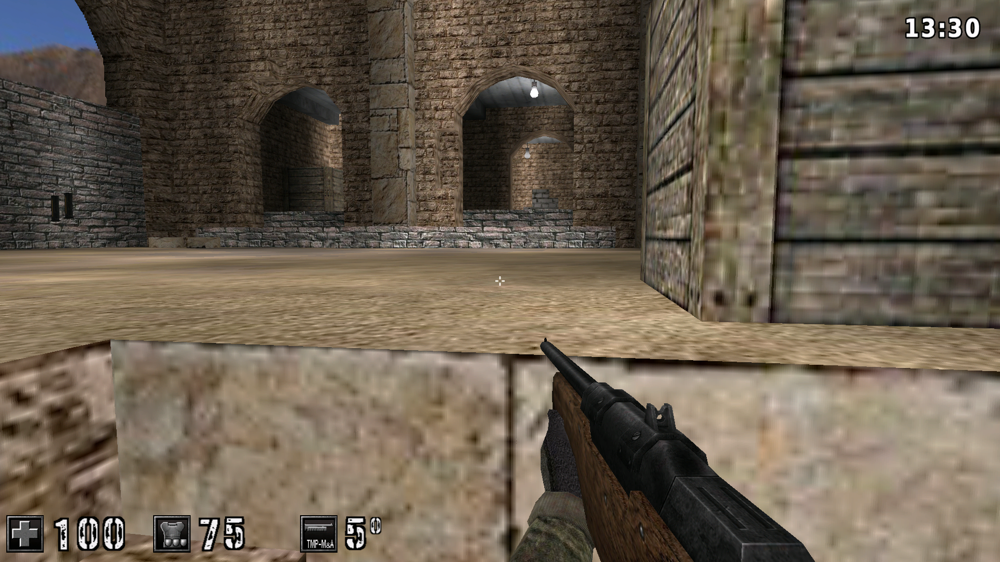
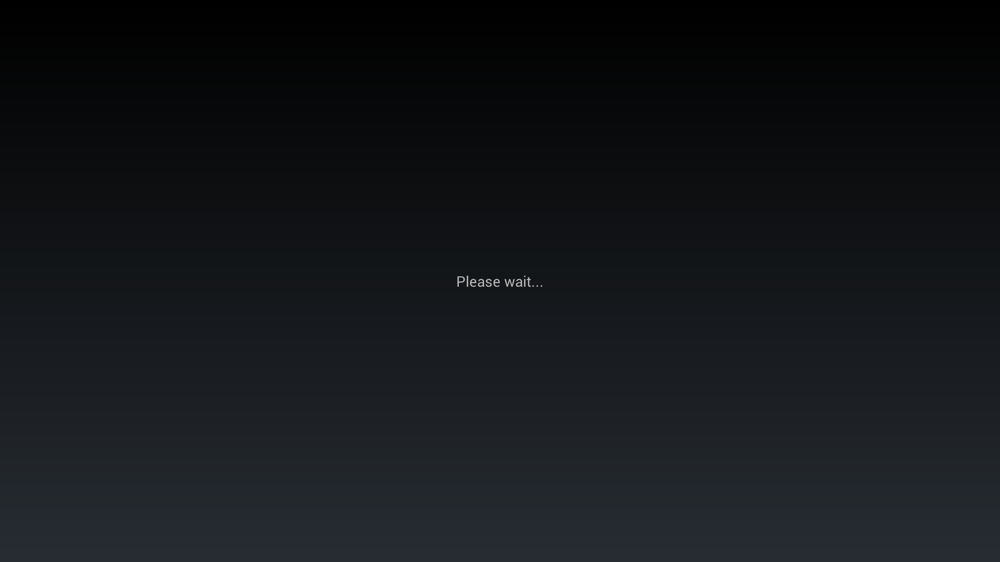
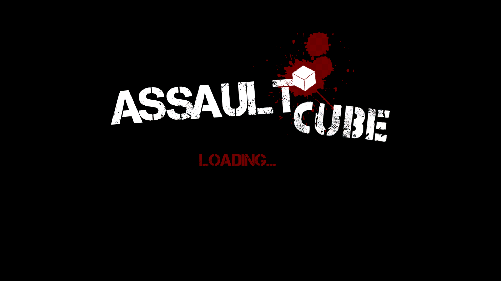
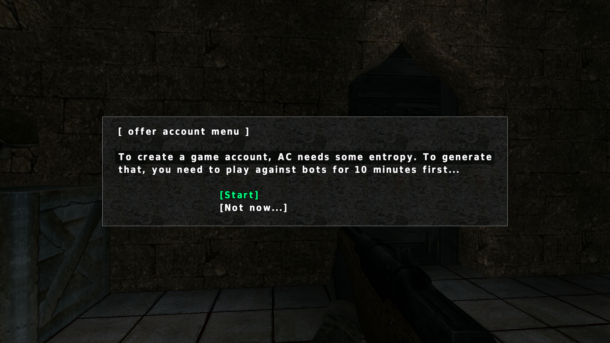

<div align="center">


# AssaultCube — OUYA Port

**[AssaultCube](https://assault.cubers.net/)** — the fast, free Cube-engine FPS — running **natively on the OUYA** console.

[](https://github.com/RyoSaeba89/assaultcube-ouya/releases/latest)

NVIDIA Tegra 3 &nbsp;·&nbsp; Android 4.1 (API 16) &nbsp;·&nbsp; OpenGL ES 2.0 &nbsp;·&nbsp; armeabi-v7a

</div>

---



## Features

- 🎮 **Full OUYA controller support** — AssaultCube is a keyboard+mouse game with *no* native gamepad support; movement, aiming, weapons, jump/crouch and menus are all mapped to the pad.
- 🖥️ **GLES2 rendering via gl4es** — the engine's desktop immediate-mode OpenGL is translated to OpenGL ES 2.0, including a workaround for the Tegra 3 Cg shader-compiler crash that kills most GLES ports on this hardware.
- ⚡ **Tuned for the Tegra 3** — renders at 720p upscaled to fullscreen, with the heaviest passes (water reflections, stencil shadows, dynamic lights) trimmed, for a smooth framerate on complex maps.
- 🌐 **Online multiplayer** — join the official AssaultCube servers (see [below](#multiplayer)).
- 🤖 **Single-player vs bots** — three difficulty levels, offline.
- 🔊 OpenAL audio; on-screen touch HUD hidden (the pad replaces it).

## Download & install

Grab **[`AssaultCube-OUYA-v1.0.apk`](https://github.com/RyoSaeba89/assaultcube-ouya/releases/latest)** from the latest release, then either copy it to the console and open it with a file manager, or sideload over ADB:

```bash
adb connect <your-ouya-ip>:5555
adb install AssaultCube-OUYA-v1.0.apk
```

The first launch extracts the game assets (~50 MB) to the console — give the "Please wait…" splash a moment on the first run only.

## Controls

| Control | Action | | Control | Action |
|---|---|:-:|---|---|
| **Left stick** | Move | | **A** | Jump |
| **Right stick** | Look | | **B** | Crouch |
| **R2** | Fire | | **X** | Reload |
| **L2** | Aim / scope | | **Y** | Knife (melee) |
| **R1 / L1** | Next / previous weapon | | **D-pad** | Grenade / pistol / weapon cycle |
| **Start** | Open / close menu | | **Back** (hold) | Scoreboard |

Look sensitivity and dead-zone are adjustable via the `gamepadlooksens` / `gamepaddeadzone` cvars (persisted).

## Multiplayer

Online play against the **official AssaultCube servers** is functional. The in-game **server browser** is
populated from a bundled official server list — the standard HTTPS masterserver fetch is bypassed because the
OUYA's API-16 TLS stack can't negotiate modern HTTPS. Open the server browser, pick a server and join.

## Screenshots

| | |
|:---:|:---:|
|  |  |
|  |  |

## Building from source

The full build recipe and engineering log — toolchain, the six hand-cross-compiled native dependencies
(gl4es, SDL2, SDL2_image, ogg/vorbis, OpenAL-Soft), every runtime fix, the controller mapping, the
performance pass and the release signing setup — is in **[OUYA_PORT.md](OUYA_PORT.md)**.

```powershell
$env:JAVA_HOME = "<portable JDK 11>"
cd source/android
.\gradlew.bat assembleRelease --no-daemon   # or assembleDebug
```

> The OUYA targets **API 16 / GLES2**, so it needs **NDK 23.2.x** (last NDK that targets `android-16` on
> armeabi-v7a) and a Java ≤ 16 JDK for AGP 7.0.2. The prebuilt native deps are not committed — see §4 of the
> port log to rebuild them.

## Credits & license

Port by **RyoSaeba89**, with engineering assistance from Claude (Anthropic).

Based on **[AssaultCube](https://github.com/assaultcube/AC)** (the `acmobile` branch) by the AssaultCube team
(Rabid Viper Productions) and contributors. The AssaultCube **source code uses a zlib/libpng-style license**
(same as the Cube engine — see [`source/README.txt`](source/README.txt) and
[`docs/license.html`](docs/license.html)); game **content** (maps, textures, sounds) is covered by its own
terms documented in the same place. This port keeps those licenses intact.

Uses [gl4es](https://github.com/ptitSeb/gl4es) (MIT), [SDL2](https://www.libsdl.org/) (zlib),
[OpenAL-Soft](https://github.com/kcat/openal-soft) (LGPL), and libogg/libvorbis (BSD).
